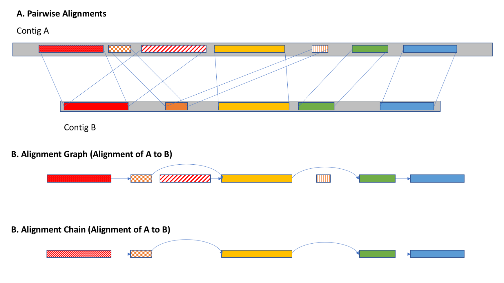
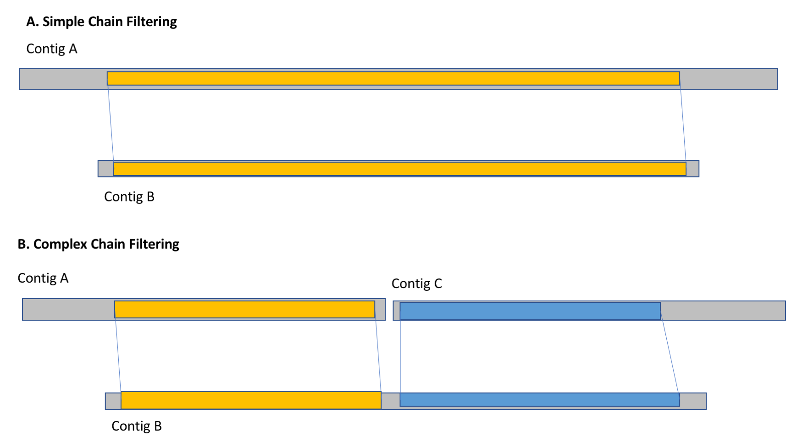

# pseudohaploid
Create pseudohaploid assemblies from a partially resolved diploid assembly

[Mike Alonge](http://michaelalonge.com/), [Srividya Ramakrishnan](https://github.com/srividya22), and [Michael C. Schatz](http://schatz-lab.org)

When assembling highly heterozygous genomes, the total span of the assembly is often nearly twice the expected (haploid) genome size, which is indicative of the assembler partially resolving the heterozygosity. This creates many duplicated genes and other duplicated features that can complicate annotation and comparative genomics. This repository contains code for post-processing an assembly to create a pseudo-haploid representation where pairs of contigs representing the same homologous sequence were filtered to select only one representative contig. The approach is similar to the approach used by [FALCON-unzip](https://www.nature.com/articles/nmeth.4035) for PacBio reads or [SuperNova](https://genome.cshlp.org/content/27/5/757) for 10X Genomics Linked Reads. As with those algorithms, our algorithm will not necessarily maintain the same phase throughout the assembly, and can arbitrarily alternate between homologous chromosomes at the ends of contigs. Unlike those methods, our method can be run as a stand-alone tool with any assembler.

**Oveview of Pseudo-haploid Genome Assembly** (a) The original sample has two homologous chromosomes labeled orange and blue. (b) In the de novo assembly, homologous regions containing higher rates of heterozygosity are split into distinct sequences (orange and blue), while regions with low rates or no heterozygous bases are collapsed to a single representative sequence (black). (c) Our algorithm attempts to filter out redundant contigs from the other homologous chromosome, although the phasing of the differ contigs may be inconsistent. Figure derived from [8]

Briefly, the algorithm begins by aligning the genome assembly to itself using the whole genome aligner `nucmer` from the [MUMmer suite](http://mummer.sourceforge.net/). We recommend the parameters `nucmer -maxmatch -l 100 -c 500` to report all alignments, unique and repetitive, at least 500bp long with a 100bp seed match. We further filtered these alignments to those that are 1000bp or longer using `delta-filter` (also part of the MUMmer suite). We also recommend the `sge_mummer` version of MUMmer so the alignments can be computed in parallel in a cluster environment: [sge_mummer github](https://github.com/fritzsedlazeck/sge_mummer) although this will produce identical results to the serial version. Finally we recommend filtering the alignments to keep those that are 90% identity or greater, to filter lower identity repetitive alignments while accommodating the expected rate of heterozygosity between homologous chromosomes while accounting for local regions of greater diversity. 

Next, the alignments were examined to identify and filter out redundant homologous contigs. We do so by linking the individual alignments into “alignment chains”, consisting of sets of alignments that are co-linear along the pair of contigs. Our method was inspired by older methods for computing synteny between distantly related genomes, although our method focuses on the problem of identifying homologous contig pairs as high identity long alignment chains. As we expect there to be structural variations between the homologous sequences, we allow for gaps in the alignments between the contigs, although true homologous contig pairs should maintain a consistent order and orientation to the alignments. Specifically, in the alignments from contig A to contig B, each aligned region of A forms a node in an alignment graph, and edges are added between nodes if they are compatible alignments, meaning they are on the same strand, and the implied gap distance on both contig A and contig B was less than 25kbp but not negative. Our algorithm then uses a depth first search starting at every node in the alignment graph to find the highest scoring chain of alignments, where the score is determined by the number of bases that are aligned in the chain. Notably, if a repetitive alignment is flanked by unique or repetitive alignments, such as the orange sequence in Contig B below, this approach will prefer to link alignments that are co-linear on Contig A. We find this produces better results than the filtering that MUMmer’s delta-filter can perform, which does not consider the context of the alignments when identifying a candidate set of non-redundant set of alignments. 

 

**Alignment Chain Construction** (a) Pairwise alignments between all contigs are computed with nucmer. Here we show just the alignments between contigs A and B. (b) An alignment graph is computed where each aligned region of A forms a node, with edges between nodes that are compatible on the same strand, in the same order, and no more than 25kbp between them. (c) The final alignment chain is selected from the alignment graph as the maximal weight path in the alignment graph.

With the alignment chains identified between pairs of contigs, the last phase of the algorithm is to remove any contigs that are redundant with other contigs originating on the homologous chromosome. Specifically, it evaluates the contigs in order from smallest to longest, and computes the fraction of the bases of each contig that are spanned by alignment chains to other non-redundant contigs. If more than X% of the contig is spanned, it is marked as redundant. This can occur in simple cases where shorter contigs are spanned by individual longer contigs as well as more complex cases where a contig is spanned by multiple shorter non-redundant contigs. We recommmend you evaluate several cutoffs for the threshold of percent of the bases spanned.

**Chain Filtering** (a) In simple cases, short contigs (contig A) are filtering out by their alignment chains to longer non-redundant contigs (contig B). (b) In complex cases, a contig (contig B) is filtered out because the total span of the alignment chains to multiple non-redundant contigs (contigs A and C) span more than X% of the bases.

## Installation

Make sure [MUMmer](http://mummer.sourceforge.net/) is installed and the binaries are in your path. We recommend version 3.23 although others may work. 

Then download the pseudohaploid code:

`
 $ git clone https://github.com/schatzlab/pseudohaploid.git
`

There is nothing else to install.

## Usage

The main script to run is `create_pseudohaploid.sh`. This is a simple bash script to simplify the steps of aligning the genome to itself, filtering the alignments, constructing and analyzing the alignment chains, and then creating the final pseudohaploid assembly. The usage is:

`
  $ create_pseudohaploid.sh assembly.fa outprefix
`

The test directory has a smalll script to run this comman on a small simple example. If everything is working well you should see:

` 
  $ cd test
  $ ./run_tests.sh
  Running the simple example
  Generating pseudohaploid genome sequence
  ----------------------------------------
  GENOME: simple.fa
  OUTPREFIX: ph.simple
  MIN_IDENTITY: 90
  MIN_LENGTH: 1000
  MIN_CONTAIN: 93
  MAX_CHAIN_GAP: 20000

  1. Aligning simple.fa to itself with nucmer
  Original assembly has 2 contigs

  2. Filter for alignments longer than 1000 bp and below 90 identity

  3. Generating coords file

  4. Identifying alignment chains: min_id: 90 min_contain: 93 max_gap: 20000
  Processing coords file (ph.simple.filter.coords)...
  Processed 6 alignment records [4 valid]
  Finding chains for 2 contigs...
  Found 2 total edges [0.000 constructtime, 0.000 searchtime, 4 stackadd]
  Looking for contained contigs...
  Found 1 joint contained contigs
  Printed 1 total contained contigs

  5. Generating a list of redundant contig ids using min_contain: 93
  Identified 1 redundant contig to remove in ph.simple.contained.ids

  6. Creating final pseudohaploid assembly in ph.simple.pseudohap.fa
  Pseudohaploid assembly has 1 contigs
`

Note the `create_pseudohaploid.sh` script is just a simple bash script so can be easily editing or incorporated into a larger pipeline. You can also swap out steps, such as replacing nucmer with sge_mummer to use a grid to compute the self alignments.
